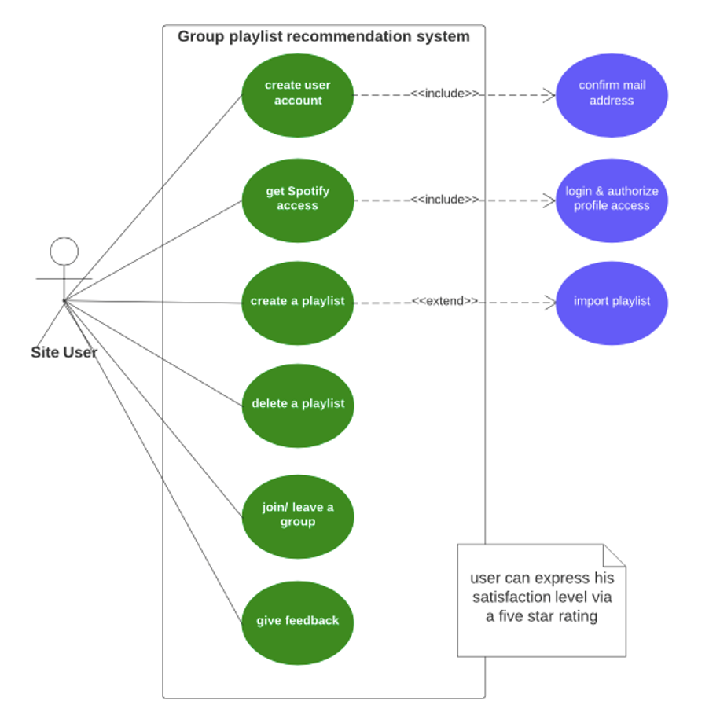
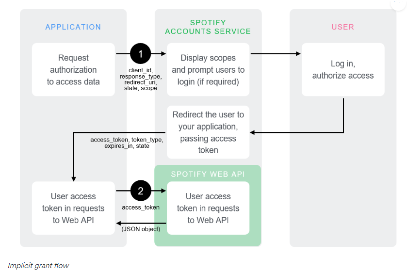

# Spotify Group Recommendations

The Spotify Group Recommendations App will mainly consist of three parts. A Frontend so the users can interact with the system.
A Backend that handles the main Business Logic for the Frontend and acts as an interface and a data parser to the Machine Learning implementation and the official Spotify API.
A Machine Learning implementation that handles the playlist generation.
The following describes the different use cases and interactions between the Frontend and the Backend.

- [Spotify Group Recommendations](#spotify-group-recommendations)
  - [General Use Case / Workflow](#general-use-case--workflow)
  - [Frontend](#frontend)
    - [User Interactions](#user-interactions)
      - [Accounts](#accounts)
      - [Groups](#groups)
      - [Playlists](#playlists)
      - [Use Cases](#use-cases)
  - [Frontend/Backend Communication](#frontendbackend-communication)
    - [Request/Response Flows](#requestresponse-flows)
      - [User Specific Spotify Data](#user-specific-spotify-data)
      - [User Data](#user-data)
      - [ML Requests](#ml-requests)
      - [Example Flow](#example-flow)
  - [Machine Learning Requirements](#machine-learning-requirements)
    - [ML Input](#ml-input)
    - [ML Output](#ml-output)
  - [Security Requirements](#security-requirements)
    - [User Accounts](#user-accounts)
      - [Backend API endpoints](#backend-api-endpoints)
    - [Spotify User Account Integration](#spotify-user-account-integration)

## General Use Case / Workflow

## Frontend

### User Interactions

From our perspective, a UML use case diagram is most appropriate to demonstrate the different ways that a user may interact with the system. The use case diagram should not provide too many details. Instead, it depicts a high-level overview between the actor (site user) and the group recommendation system. In this way, it supplements the written requirements.

#### Accounts

It should be possible to create accounts in the Spotify group recommendation system. Every user needs to be able to form groups and invite/add other users to the groups.
User specific data, like friends, groups, Spotify connections (tokens) will be saved into a user database. This ensures a consistent reusability for every user.
Every user has access to all of his data and can delete the data at any time.

#### Groups

A group consists of a minimum of 2 users and can have multiple group playlists. Every group member can create a playlist.
It is possible to leave a group. A group itself will only be deleted wenn every user has left the group. This ensures that you still have access to group data even if every other member has left the group.

#### Playlists

After a group member has created a playlist it will be linked to the Spotify account of the creating user. Otherwise the app would need to create some form of an anonymous/group specific user in Spotify.
In addition to the playlist being linked to the user, it will also be saved in the apps database. This prevents loss of data if the creating user decides to remove the playlist from inside of his Spotify account.

#### Use Cases

| Goal | Create a user account |
| --- | --- |
| Primary Actor | Unregistered User |
| Scope | Frontend and User Db |
| Level | User |
| Precondition | Unregistered user is at registration screen/page |
| Success end | User account is created |
| Failure end condition | User account is not created |
| Trigger | Unregistered user accesses registration page |
| Main success scenario | 1. Unregistered User enters username and password   2.User is saved to Db   3. System informs user of creation   4. User is forwarded to Account Page   5. (Optional) User continues with setting up Spotify Access |
| Extensions (Error scenarios) | 1. Username already exists   2. Some form of connectivity issues with the backend |
| Variations (alternate scenarios) |

| Goal | Get Users Spotify Access |
| --- | --- |
| Primary Actor | User |
| Scope | Frontend and Backend API |
| Level | User |
| Precondition | User is at account page |
| Success end | App has access to users Spotify account through Spotify API |
| Failure end condition | No access to Spotify API |
| Trigger | User presses button ‘connect with Spotify’ |
| Main success scenario | 1. User presses button   2. User provides needed data to get user specific information through the Spotify API   3. Test request to Spotify API returns some form of 200 Status |
| Extensions (Error scenarios) | 1. Data provided by user is wrong   2.Spotify API is unreachable   3. User has no Spotify account |
| Variations (alternate scenarios) |

| Goal | Creating a playlist |
| --- | --- |
| Primary Actor | User |
| Scope | Frontend and Backend API |
| Level | User |
| Precondition | User is on group page and starts playlist creation |
| Success end | A new group playlist is created |
| Failure end condition | No new playlist created |
| Trigger | User presses Button ‘Create Playlist’ |
| Main success scenario | 1. User starts playlist creation   2. User specifies playlist conditions   2.a E.g. specific genre   2.b Main variable that should be applied (song listen count etc)   4. User confirms selection   4. Playlist is returned as a link and saved to db |
| Extensions (Error scenarios) | 1. Not all necessary decisions on conditions have been made   2. Spotify not reachable   3. Db access unavailable |
| Variations (alternate scenarios) |

| Goal | Deleting a playlist |
| --- | --- |
| Primary Actor | User |
| Scope | Frontend and Backend API |
| Level | User |
| Precondition | User is at group management site |
| Success end | Playlist is deleted on user account |
| Failure end condition | Playlist not deleted |
| Trigger | User presses Button ‘Create Playlist’ |
| Main success scenario | 1. User decides to delete playlist that has been created from his spotify account   2. User Clicks ‘Delete’ Button   3. Playlist is removed from Users spotify account but not from the apps Db   4. UI informs about deletion |
| Extensions (Error scenarios) | 1. No Spotify access   2. User has no created playlists |
| Variations (alternate scenarios) |

| Goal | Leaving a group |
| --- | --- |
| Primary Actor | User |
| Scope | Frontend and Backend API |
| Level | User |
| Precondition | User is at group management site |
| Success end | User has left group |
| Failure end condition | User has not left group |
| Trigger | User presses 'Leave Group’ button |
| Main success scenario | 1. User chooses to leave group   2. UI informs about success   3. Group is no longer accessible from users perspective |
| Extensions (Error scenarios) | 1. No backend API access   1.a User gets removed from group   2.b. Group itself is deleted as well |
| Variations (alternate scenarios) |

| Goal | User satisfaction |
| --- | --- |
| Primary Actor | User |
| Scope | Frontend + Backend / Voting interface |
| Level | User |
| Precondition | Users listened to the playlist |
| Success end | Users rated the experience with the playlist 3.5/5 or higher |
| Failure end condition | Rating is lower or non-existent |
| Trigger | Users used integrated voting system to vote on playlist |
| Main success scenario | 1. Users listened to music   2. Users vote   3. Rating is saved and displayed |
| Extensions (Error scenarios) | 1. Rating is made before playlist has been listened to   4. Other users who didn’t have the music playing on their phone but participated in the group can’t vote |
| Variations (alternate scenarios) | No voting happened, no voting gets saved. |

## Frontend/Backend Communication

All logic will be handled by the backend API of the group recommendation app.
The backend receives requests from the frontend, parses them and sends them to the ML interface.

### Request/Response Flows

#### User Specific Spotify Data

This Flow includes user specific data and thus will probably be handled by a multiple endpoints.
Possible requests could be

- Validate user access
- Get users Spotify library
- Add playlist to user
- Delete playlist from user
- Get metadata of users songs/playlists

#### User Data

This flow handles user data that is not related to spotify. This means the users that have registered on the app, created playlists and so on.

| Goal | Get/Manipulate User Data |
| --- | --- |
| Primary Actor | Frontend |
| Scope | Frontend + Backend (User Db) |
| Level | Internal |
| Precondition | Frontend has sent request |
| Success end | Backend returns requested data |
| Failure end condition | Data not available |
| Trigger | Frontend request |
| Main success scenario | 1. Request is received   2. Content is parsed   3. Content is sent to user db   4. Response is received from user db   5. Response is received and status is returned (success/failure) |
| Extensions (Error scenarios) | 1. Malformed request   2. Data unavailable |
| Variations (alternate scenarios) |

#### ML Requests

These flows contain data to produce/handle the newly generated playlists.
The normal flow is that the user has requested a new playlist and the backend is then responsible for sending the multiple requests and responses.

#### Example Flow

Request Playlist (includes group members and possibly genre)
-> Backend request user (multiple users) metadata from Spotify
-> metadata is parsed into a format that the ML interface can handle
-> send request to ML interface
-> Receive response from ML
-> possibly parse response
-> send data to Spotify to create and save a new playlist
-> send request status back to frontend

| Goal | Get new playlist |
| --- | --- |
| Primary Actor | Frontend and ML |
| Scope | Frontend and ML |
| Level | Internal and external |
| Precondition | Frontend has sent request |
| Success end | Backend returns requested data |
| Failure end condition | Data not available |
| Trigger | Frontend request |
| Main success scenario | 1. Request is received   2. Content is parsed   3. Content is sent to ML interface   4. Response is received from ML interface   5. Playlist is returned to Frontend and sent to Spotify |
| Extensions (Error scenarios) | 1. Malformed request   2. Data unavailable |
| Variations (alternate scenarios) |

## Machine Learning Requirements

### ML Input

### ML Output

## Security Requirements

Security is a big topic of concern for a lot of users. In order to keep risks and maintenance resources at a minimum we try to outsource as much as possible when it comes to the topic of sensitive data.

For this reason we will separate user data into two groups. The first group is our own user management. The second group of concern is access to the users Spotify account/api.

### User Accounts

Our own user management system should be as simple as possible and contain as little sensitive data as possible.
For this reason we will have our own user database. The database will only save information directly associated to our platform, such as login data, groups of the users and possibly playlists. It would even be possible to not save the playlists itself since it will be possible for the users to integrate previously created playlists into the Spotify account.

Nonetheless as soon as we would release a version of our app to the public we should use a token based flow for interacting with the backend and consider following secure and proven strategies like [OpenId Connect](https://openid.net/connect/).

#### Backend API endpoints

We will use our API to access user data of our own registered users. The following is a minimal list of endpoints that we have to provide to access user data.

- **GET** */api/[version]/users*
  - returns all users we have currently in our database
- **GET** */api/[version]/users/{id}*
  - returns a specific user
- **GET** */api/[version]/groups*
  - returns all user groups currently in our database
- **GET** */api/[version]/groups/{id}*
  - returns a specific user group
- **POST** */api/[version]/users*
  - create a new user
- **POST** */api/[version]/groups*
  - create a new usergroup (requires a REQUEST body)
- **PUT/PATCH** */api/[version]/users/{id}*
  - update user specific data
- **PUT/PATCH** *api/[version]/groups/{id}*
  - update group specific data
- **DELETE** *api/[version]/users/{id}*
  - delete a user from our database
- **DELETE** *api/[version]/groups/{id}*
  - delete group data from our database

If we decide during development that we need to include playlist related data into our database, these endpoints must be updated accordingly.

### Spotify User Account Integration

The spotify API offers different [scopes](https://developer.spotify.com/documentation/general/guides/authorization/scopes/) to access data. Each scope represents/includes a group of data that can be obtained. For example accessing playlist related user data.
In order to minimize risks and security concerns we should focus on short lived access tokens and permissions.
For this is would be a good idea to rely on the [implicit grant flow](https://developer.spotify.com/documentation/general/guides/authorization/implicit-grant/) that Spotify provides.

The advantage and why we should use this flow is that it allows to specify the scope we would need in order to access user data and that the flow is short-lived.

