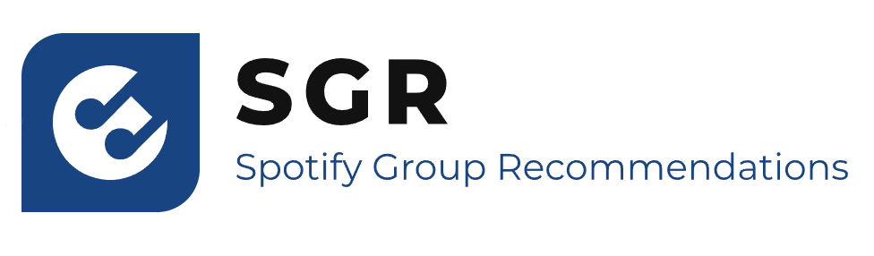

# Spotify Group Recommendation

Place some good explanation text here...

## Development

### VS Code

The workspace file includes recommendations for vs code extensions.

## User Interface

The User Interface was built with React. Check the Readme under spotify-group-recommendation.ui for more.

## Backend
